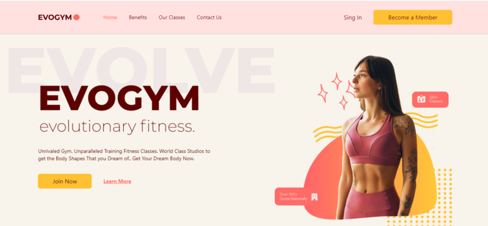

# Gym-TypeScript

Website con React y TypeScript utilizando Tailwind CSS. Una página web moderna y atractiva para un gimnasio, desarrollada con componentes reutilizables y enfocada en una experiencia intuitiva para los usuarios.

## Tecnologías principales

 React  
 TypeScript  
 Vite  
 Netlify  
 Tailwind  

## Capturas de pantalla

Aquí se muestran las capturas de pantalla de la página web en la versión de escritorio:
  
  
  

## Créditos
El proyecto fue creado a partir de un video tutorial de JavaScript Mastery titulado "Build a Complete Typescript React Fitness Application for Beginners | Responsive". Puedes encontrar el video tutorial en [este enlace](https://www.youtube.com/watch?v=I2NNxr3WPDo).

## Enlace
Puedes acceder a la página web en el siguiente enlace:
[URL del sitio](https://evogym-typescript.netlify.app)
